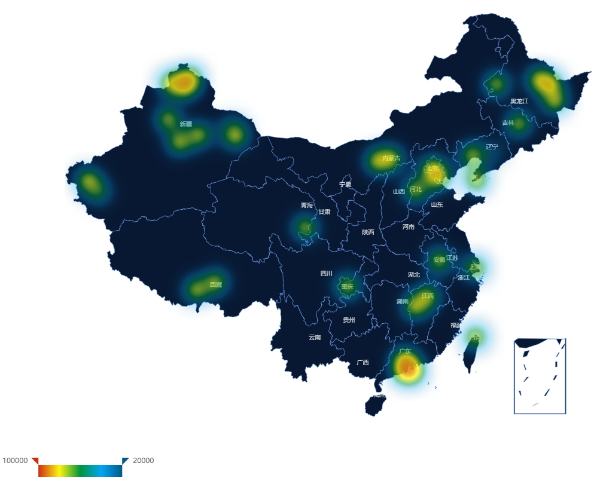

# Echarts Heatmap

> 昨天帮朋友做的一个热力图展示界面，用到了 `echarts.js`，搞了一会儿觉得很有趣，就整理一下放到这存着，有需要的自行下载。如果需要放到框架中的请自行重构，后续我也会进行整合并将仓库更新。
Yesterday(2021/12/13) I Helped a friend to do a heatmap display interface by using `echarts.js`. In this process I feel very interesting and put it here. if it is necessary for you ,then you can download it. If you need to put it into the framework like `Vue`、 `React` or  `Angular`, please refactory it by yourself. And of course I will also refactory it and update this docment later.

## 在线地址

[Online Demo](http://120.78.207.151/heatmap/)

## 注意事项

### 1.引入对应的省份`.js` 文件,本项目中引入的是全国地图

### 2.各个区经纬度

### 3.坐标轴、网格、`visualMap` 等相关设置

### 4.当前只是用来练手的静态页面，完善后将结合 `vue2` 或 `vue3` 进行重构并重新创建仓库，当前仓库不变

## 欢迎大家 mark、star、issue

## Thank you all
